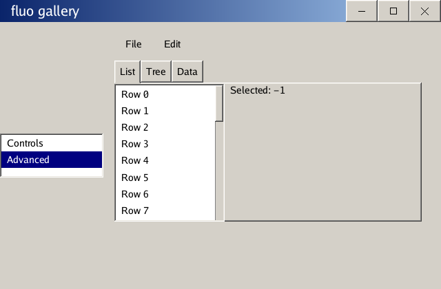

# fluo

A retained-mode GUI toolkit for Go with its own OpenGL renderer and a classic
Windows-2000 look. fluo gives a Go program a themed widget tree — layout, input
routing, and data binding — over a thin OpenGL 3.3 backend. No browser engine,
no native OS toolkit underneath.

Controls draw themselves from swappable design tokens, so restyling an app is a
data change. Each package stands on its own, so you can pull in just the
renderer or the whole stack.



## Features

- A complete control set: buttons, checkboxes, radio groups, toggle switches,
  text boxes, sliders, progress bars, combo boxes, tooltips, list/tree/tab
  views, expanders, menus, modal dialogs, toasts, and a virtualized data grid.
  Layout panels (stack, grid, dock, wrap, canvas), a draggable split panel, and
  a custom title bar for undecorated windows come with it.
- A text box that scales from a one-line field to a small code editor: word
  wrap, a line-number gutter, Tab-to-indent with block indent/outdent,
  word-wise motion, double-click-word and triple-click-line selection, and
  IME input.
- Classic Windows-2000 chrome: four-tone raised and sunken bevels, square
  corners, gradient title bars. The classic themes don't reach for soft
  effects, but the primitives are there — `DrawShadow`, `DrawBackdropBlur`,
  and an `AcrylicSurface` control built on them.
- Light and dark themes, both driven entirely by design tokens. Roll your own
  by copying one and changing a few colors.
- One- and two-way data binding between typed properties and controls, plus
  observable-list collection binding.
- Virtualized list and data-grid views for large data sets.

## Requirements

- Go 1.23
- A C compiler — the `go-gl/glfw` and `go-gl/gl` bindings use cgo
- An OpenGL 3.3 core-profile driver

## Install

```sh
go get github.com/0xdreadnaught/fluo
```

## Quickstart

```go
package main

import (
	"log"

	"github.com/0xdreadnaught/fluo/app"
	"github.com/0xdreadnaught/fluo/controls"
	"github.com/0xdreadnaught/fluo/core"
	"github.com/0xdreadnaught/fluo/render"
	"github.com/0xdreadnaught/fluo/text"

	"golang.org/x/image/font/gofont/goregular"
)

func main() {
	font, _ := text.Load(goregular.TTF)
	root := controls.NewTextBlock(text.NewFace(font, 16), "Hello, fluo!")

	log.Fatal(app.Run(app.Config{Title: "hello", Width: 320, Height: 200}, func(c *app.Ctx) {
		c.Input.SetRoot(root)
		core.MeasureWidget(root, c.Size)
		core.ArrangeWidget(root, render.Rect{W: c.Size.W, H: c.Size.H})
		core.RenderWidget(root, c.R)
	}))
}
```

[`examples/counter`](examples/counter) shows the same thing with a proper
one-time root guard and a data-bound label.

## Architecture

fluo is layered bottom to top; each layer depends only on the ones below it.

| Package            | Role                                                                 |
| ------------------ | ------------------------------------------------------------------- |
| `render`, `render/gl` | Renderer interface and geometry, implemented on OpenGL 3.3       |
| `text`             | Font loading and glyph rasterization                                |
| `core`             | Widget/Element layout engine (Measure/Arrange/Render) and `Property[T]` |
| `input`            | Hit-testing, event bubbling, capture, focus                         |
| `theme`            | Color, metric, and typography tokens (`Light()`, `Dark()`)          |
| `controls`         | The built-in widget set                                             |
| `bind`             | One- and two-way binding                                            |
| `anim`, `timers`   | Tween animation and the frame-tick timer service                    |
| `app`              | glfw window host and embeddable surface                             |

## Examples

- [`examples/counter`](examples/counter) — a button incrementing a bound `Property[int]`.
- [`examples/form`](examples/form) — text box, checkbox, and slider two-way bound to a model.
- [`examples/todo`](examples/todo) — a to-do list backed by an observable `bind.List`.
- [`cmd/fluo-gallery`](cmd/fluo-gallery) — every control together, with a live theme toggle (press **T**).
- [`cmd/fluo-demo`](cmd/fluo-demo) — the bare renderer primitives.

Run any of them with `go run`, e.g. `go run ./cmd/fluo-gallery`.

## Documentation

`go doc ./<package>` covers each package. Longer guides — controls, data
binding, theming, and the renderer — live in [`docs/wiki`](docs/wiki.md).

## Status

v0.15.1. Every layer is implemented, tested (headless layout and binding tests
plus GL golden images that auto-skip without a GPU), and exercised together by
the gallery. Known gaps:

- The custom title bar covers Windows and Linux. There's no native macOS
  integration.
- No accessibility (screen-reader) hooks yet.

See [CHANGELOG.md](CHANGELOG.md) and [ROADMAP.md](ROADMAP.md) for the full
history.

## License

[MIT](LICENSE)
